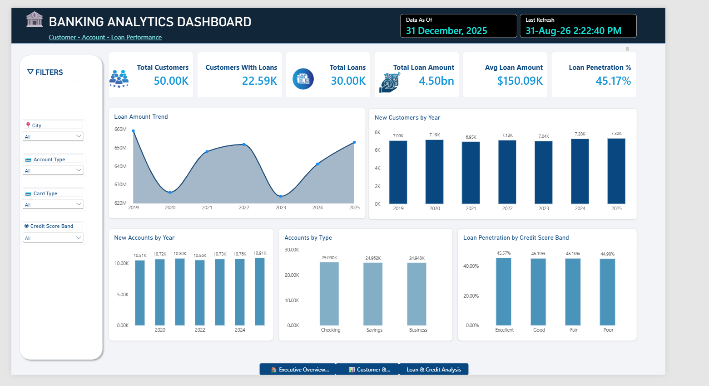
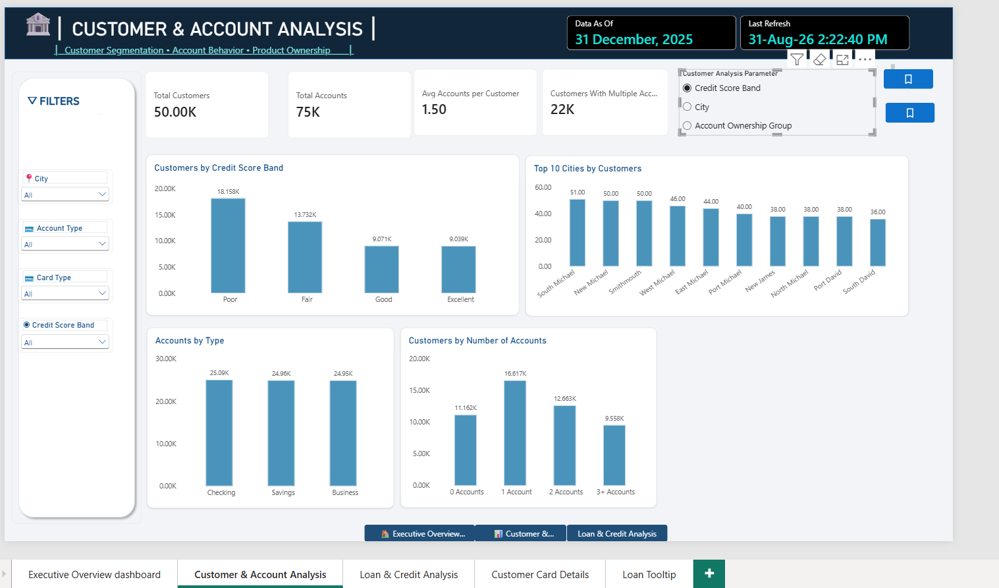
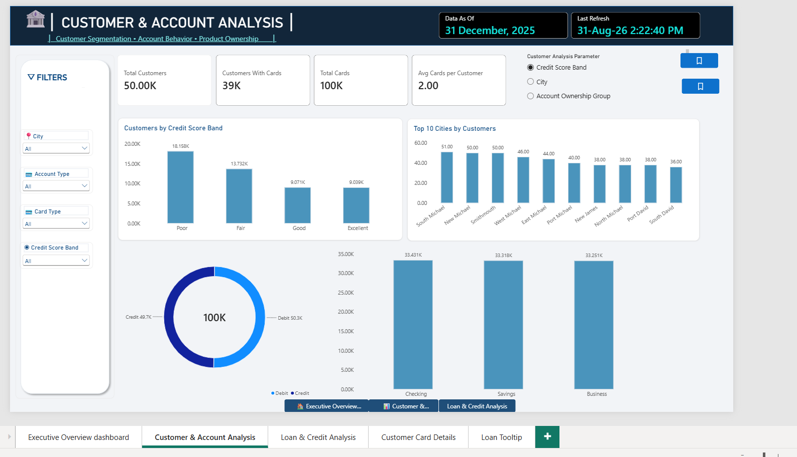
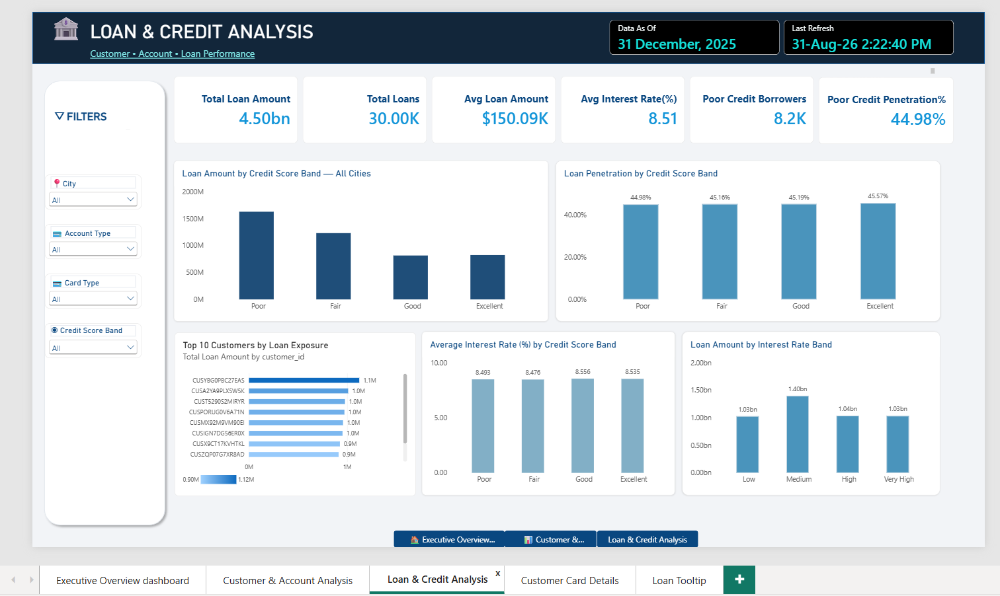
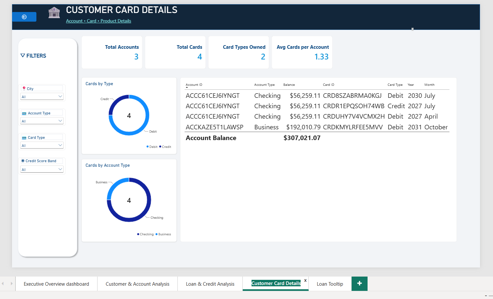
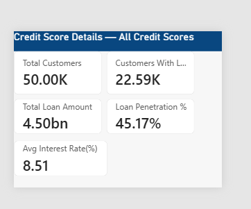

# 🏦 Banking Analytics — SQL & Power BI

## 📌 Project Overview

**Banking Analytics Dashboard** is an end-to-end data analytics project designed to analyze **customer, account, card, and loan performance** within a retail banking environment.

The project combines **SQL for data validation, profiling, and analytical querying** with **Power BI for data modeling, DAX calculations, interactive dashboarding, KPI reporting, customer segmentation, loan analysis, and business insights**.

The objective is to transform raw banking data into actionable insights that can support **customer analysis, lending decisions, product adoption, portfolio monitoring, and management reporting**.

---

## 🎯 Business Objectives

The analysis addresses key banking business questions:

* Analyze the overall customer and account base
* Measure customers with loans and total loan exposure
* Compare customer segments by credit-score band
* Analyze loan penetration across credit-score segments
* Identify customers with high loan exposure
* Analyze account and card ownership
* Evaluate customer, account, and loan trends over time
* Identify customer and product segments requiring management attention
* Translate analytical findings into actionable business recommendations

---

## 🛠️ Tools & Technologies

| Area               | Technology          |
| ------------------ | ------------------- |
| Data Analysis      | SQL                 |
| Database           | Relational Database |
| Data Visualization | Power BI            |
| Data Modeling      | Power BI Data Model |
| Calculations       | DAX                 |
| Data Validation    | SQL                 |
| Dashboard Design   | Power BI            |
| Documentation      | GitHub / Markdown   |

The project follows an **end-to-end, SQL-first analytics workflow**, ensuring that key metrics and analytical results are validated before being presented through Power BI.

---

# 🔄 Project Workflow

```text
Raw Banking Data
       ↓
Data Import
       ↓
Data Quality & Validation
       ↓
SQL Analysis
       ↓
Customer / Account / Loan / Card Analysis
       ↓
Time-Series Analysis
       ↓
Power BI Data Model
       ↓
DAX KPI Measures
       ↓
Interactive Power BI Dashboard
       ↓
Business Insights & Recommendations
```

---

# 🧮 SQL Analysis

The SQL analysis was organized into dedicated analytical areas.

## 01 — Data Quality & Validation

* Data completeness checks
* Duplicate detection
* Data consistency validation
* Basic data profiling
* Key and relationship validation

## 02 — Customer Analysis

* Customer counts
* Customer segmentation
* Credit-score analysis
* City-level customer distribution
* Customer-level analysis

## 03 — Account Analysis

* Accounts by account type
* Account ownership
* Customer-to-account relationships
* Multiple-account customers
* Account distribution analysis

## 04 — Loan Analysis

* Total number of loans
* Total loan amount
* Average loan amount
* Customer loan exposure
* Loan analysis by credit-score band
* Top customers by loan exposure
* Interest-rate analysis

## 05 — Card Analysis

* Total cards
* Card ownership
* Debit vs. credit card analysis
* Cards by account type
* Customer card ownership

## 06 — Time-Series Analysis

* New customers over time
* New accounts over time
* Loan amount trends
* Customer and account growth trends

## 07 — Advanced SQL

* Common Table Expressions (CTEs)
* Window functions
* Ranking functions
* Analytical comparisons
* Customer-level ranking
* Advanced aggregations
* Loan exposure analysis

The SQL layer provides the analytical foundation for the Power BI dashboard and demonstrates that dashboard metrics were supported by structured analytical queries rather than relying solely on visual-level calculations.

---

# 📊 Power BI Dashboard

## Page 1 — Executive Overview

Provides a management-level snapshot of the customer and lending portfolio.

### KPIs

* Total Customers
* Customers With Loans
* Total Loans
* Total Loan Amount
* Average Loan Amount
* Loan Penetration %

### Visuals

* Loan Amount Trend
* New Customers by Year
* New Accounts by Year
* Accounts by Type
* Loan Penetration by Credit Score Band



---

## Page 2 — Customer & Account Analysis

Focuses on customer segmentation, account ownership, and account behavior.

### KPIs

* Total Customers
* Total Accounts
* Average Accounts per Customer
* Customers With Multiple Accounts

### Visuals

* Customers by Credit Score Band
* Top 10 Cities by Customers
* Accounts by Account Type
* Customers by Number of Accounts
* Customer Analysis Parameter
* Interactive Bookmark





---

## Page 3 — Loan & Credit Analysis

Focuses on lending exposure, credit segmentation, and interest-rate analysis.

### KPIs

* Total Loan Amount
* Total Loans
* Average Loan Amount
* Average Interest Rate
* Poor Credit Borrowers
* Poor Credit Penetration

### Visuals

* Loan Amount by Credit Score Band
* Loan Penetration by Credit Score Band
* Top 10 Customers by Loan Exposure
* Average Interest Rate by Credit Score Band
* Loan Amount by Interest Rate Band



---

## Page 4 — Customer & Card Details

Provides customer-, account-, and card-level analysis.

### KPIs

* Total Accounts
* Total Cards
* Card Types Owned
* Average Cards per Account

### Visuals

* Cards by Type
* Cards by Account Type
* Account / Card Detail Table



---

## Page 5 — Loan Tooltip

A dedicated tooltip page provides contextual loan and credit KPIs when users interact with relevant visuals.

This allows users to access additional loan-related information without leaving the primary dashboard page.



---

# 🔎 Interactive Analysis

The dashboard allows users to dynamically change the analytical context using interactive slicers and controls, including:

* City
* Account Type
* Card Type
* Credit Score Band

Dashboard interactions were validated to ensure that selections dynamically update the relevant KPIs, charts, and analytical views.

### Example Interactions

**Credit Score Band**

```text
Poor → Dashboard metrics update
Excellent → Dashboard metrics update
```

**City Selection**

```text
City → Customer KPIs → Account Analysis → Relevant Charts Update
```

These interactions make the report an **interactive analytical tool rather than a static collection of charts**.

---

# 🔗 Live Power BI Dashboard

### Interactive Report
**Banking Customer & Loan Analytics**
The report is publicly accessible through the Power BI web viewer.
🔗 View Interactive Power BI Dashboard


# 📈 Key Business Insights

## 1. Customer Base

Approximately **50K customers** are represented in the analysis.

| Credit Score Band | Customers |
| ----------------- | --------: |
| Poor              |    18.16K |
| Fair              |    13.73K |
| Good              |     9.07K |
| Excellent         |     9.04K |

### Key Insight

The **Poor-credit segment is the largest credit-score group**, representing approximately 18.16K customers.

### Business Implication

The bank could consider targeted **credit-building programs, financial education, and risk-based product strategies** for this customer segment.

---

## 2. Loan Portfolio

The analysis identifies a substantial lending portfolio.

| Metric               |    Value |
| -------------------- | -------: |
| Total Loans          |      30K |
| Total Loan Amount    |   $4.50B |
| Average Loan Amount  | $150.09K |
| Customers With Loans |   22.59K |
| Loan Penetration     |   45.17% |

### Key Insight

Lending represents a significant component of the banking portfolio, with approximately **45% of customers holding loans**.

### Business Implication

The bank can monitor lending performance by combining **loan volume, exposure, customer segment, credit profile, and interest-rate characteristics**.

---

## 3. Loan Penetration by Credit Score

| Credit Score Band | Loan Penetration |
| ----------------- | ---------------: |
| Poor              |           44.98% |
| Fair              |           45.16% |
| Good              |           45.19% |
| Excellent         |           45.57% |

### Key Insight

Loan penetration varies by **less than one percentage point** across the four credit-score bands.

### Business Implication

Credit score alone does not appear to explain significant differences in loan adoption. Management should evaluate additional factors such as:

* Loan amount
* Interest rate
* Repayment behavior
* Customer profile
* Product relationship
* Portfolio profitability

---

## 4. Loan Amount Trend

| Year | Approx. Loan Amount |
| ---- | ------------------: |
| 2019 |               $659M |
| 2020 |               $626M |
| 2021 |               $648M |
| 2022 |               $652M |
| 2023 |               $624M |
| 2024 |               $641M |
| 2025 |               $653M |

### Key Insight

The loan portfolio experienced declines in **2020 and 2023**, followed by recovery in subsequent years.

### Business Implication

These periods could be investigated further to determine whether changes were associated with:

* Customer demand
* Lending strategy
* Interest rates
* Economic conditions
* Portfolio composition

---

## 5. Customer Acquisition

| Year | New Customers |
| ---- | ------------: |
| 2019 |         7.09K |
| 2020 |         7.19K |
| 2021 |         6.95K |
| 2022 |         7.13K |
| 2023 |         7.04K |
| 2024 |         7.28K |
| 2025 |         7.32K |

### Key Insight

Customer acquisition remained relatively stable throughout the period, with stronger acquisition levels during **2024–2025**.

### Business Implication

Customer acquisition should be evaluated beyond acquisition volume by measuring how effectively new customers adopt additional banking products.

A useful customer journey would be:

```text
New Customer
     ↓
Account
     ↓
Card
     ↓
Loan
     ↓
Additional Products
```

---

## 6. Account Distribution

| Account Type | Accounts |
| ------------ | -------: |
| Checking     |   25.09K |
| Savings      |   24.96K |
| Business     |   24.95K |

### Key Insight

The three account types are distributed almost evenly, indicating a relatively balanced account portfolio.

---

## 7. Multiple-Account Opportunity

| Accounts per Customer | Customers |
| --------------------- | --------: |
| 0                     |    11.16K |
| 1                     |    16.62K |
| 2                     |    12.66K |
| 3+                    |     9.56K |

### Key Insight

Customers with **one account represent the largest customer group**.

### Business Implication

Single-account customers represent a potential **cross-selling opportunity** for additional accounts, cards, and lending products.

---

## 8. Card Portfolio

Approximately **100K cards** and **39K customers with cards** are represented in the analysis.

The dashboard analyzes:

* Debit vs. credit cards
* Card ownership
* Cards by account type
* Cards per customer/account
* Account-level card details

### Key Insight

Card ownership can be analyzed alongside account relationships to identify opportunities for **product adoption, customer engagement, and cross-selling**.

---

## 9. High Loan Exposure

The **Top 10 Customers by Loan Exposure** identifies customers carrying the largest loan balances.

However, loan exposure alone does not provide a complete view of credit risk.

A stronger risk-monitoring framework combines:

```text
Loan Exposure
      +
Credit Score
      +
Interest Rate
      +
Customer / Product Profile
```

### Business Implication

High-exposure customers can be prioritized for deeper portfolio monitoring and risk assessment.

---

# 💡 Business Recommendations

## 1. Develop Credit-Building Strategies

The Poor-credit segment represents the largest credit-score group. The bank could develop targeted financial education, credit-building products, and risk-based offerings while maintaining appropriate credit controls.

## 2. Cross-Sell Single-Account Customers

Customers with only one account represent the largest account-ownership segment.

Targeted campaigns could encourage adoption of:

* Additional accounts
* Credit or debit cards
* Lending products
* Other relevant banking services

## 3. Strengthen High-Exposure Monitoring

Monitor high loan exposure using multiple risk dimensions rather than loan balance alone:

**Exposure + Credit Score + Interest Rate + Customer Profile**

This provides a more complete view of potential portfolio risk.

## 4. Investigate Loan Portfolio Declines

The declines observed in **2020 and 2023** should be investigated to identify the underlying business drivers and determine whether similar patterns could affect future lending performance.

## 5. Improve New-Customer Conversion

Customer acquisition should be evaluated beyond the number of new customers acquired.

Management should track the progression from:

**New Customer → Account → Card → Loan → Additional Product**

This can help measure **customer activation, product adoption, retention, and cross-selling effectiveness**.

---

# 📁 Repository Structure

```text
banking-dataset-kaggle/
│
├── data/
│   ├── csv/
│   ├── database/
│   ├── screenshots/
│   └── sql_script/
│
├── Banking Customer & Loan Analytics.pbix
│
└── README.md
```

---

# 🎓 Skills Demonstrated

## SQL

* Data validation
* Data profiling
* Joins
* Filtering
* Aggregations
* `GROUP BY` / `HAVING`
* Common Table Expressions (CTEs)
* Ranking
* Window functions
* Time-series analysis
* Customer analysis
* Loan analysis
* Business analysis

## Power BI

* Data modeling
* DAX
* KPI development
* Interactive slicers
* Dynamic filtering
* Bookmarks
* Tooltip pages
* Dashboard design
* Data storytelling
* Executive reporting

## Business Analytics

* Customer segmentation
* Credit-risk analysis
* Loan portfolio analysis
* Product adoption
* Customer acquisition
* Cross-selling analysis
* Account analysis
* Card analysis
* Trend analysis
* Executive reporting
* Business recommendations

---

# 🚀 Portfolio Value

This project demonstrates a complete **end-to-end Data Analyst / BI Analyst workflow**:

```text
SQL
 ↓
Data Validation
 ↓
Analytical Querying
 ↓
Business Analysis
 ↓
Power BI Data Modeling
 ↓
DAX
 ↓
Interactive Dashboard
 ↓
Business Insights
 ↓
Recommendations
```

The project demonstrates the ability to move from **raw banking data** through **data validation, analytical SQL, data modeling, DAX, and interactive Power BI reporting**, and ultimately translate analytical findings into **actionable business recommendations**.

It showcases practical experience across:

**Data Analysis → Data Validation → SQL → Data Modeling → DAX → Visualization → Business Intelligence → Business Storytelling**

This makes the project representative of a real-world **Data Analyst / BI Analyst workflow**, rather than simply a dashboard visualization exercise.
